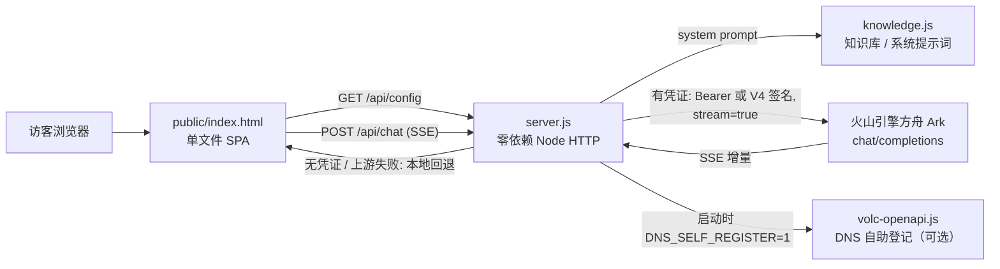

# 深信服智能客服 · Sangfor AI Customer Service

> 深信服科技官网风格的 7×24 在线智能客服演示：零依赖 Node 后端，流式代理火山引擎方舟（Ark）大模型；未配置 Key 时自动降级为本地知识库「演示模式」，页面始终可用。

[](https://nodejs.org/)
[](https://nodejs.org/api/)
[](https://hub.docker.com/_/node)
[](https://www.volcengine.com/product/ark)
[](#许可证)
[](https://shenxin.versecraft.cn)

## 这是什么

面向访客的智能客服 Web 应用，模拟深信服科技（Sangfor，股票代码 300454）官网的在线客服。访客在企业蓝聊天界面里提问，后端以流式（SSE）把对话转发给火山引擎方舟（Ark）大模型，并注入一份深信服公司 / 产品 / 服务的知识库作为系统提示词，让回答始终聚焦在深信服的网络安全、信服云、安全 GPT 等业务上。

工程取向很明确：

- **零运行依赖**：整个后端只用 Node 内置模块（`http` / `fs` / `crypto`），没有 `package.json`、无需 `npm install`，构建快、国内网络友好。
- **永远可用**：未配置任何大模型凭证、或上游调用失败时，自动回退到本地知识库逐字应答（演示模式），页面不会因为缺 Key 而崩。
- **生产加固**：内置限流、并发上限、输入校验、上游超时、断连即止、安全响应头与优雅停机，面向 Coolify 等容器平台的真实部署。

🔗 在线体验：<https://shenxin.versecraft.cn>

## ✨ 核心特性

- **流式对话（SSE）** — 后端 `POST /api/chat` 以 `text/event-stream` 把模型增量逐字推送给前端，配合打字机式渲染，首字延迟低、体验接近真人客服。
- **双鉴权接入 Ark** — 既支持方舟控制台的 `ARK_API_KEY`（Bearer），也支持用 `VOLC_AK` / `VOLC_SK` 做火山引擎 V4 签名直连（`signedArkHeaders`，基于 `crypto` 自实现 HMAC-SHA256）；二选一即可，适配「有 API Key」和「只有访问密钥」两种环境。
- **演示模式自动降级** — 无凭证（`HAS_LLM=false`）或上游报错时，调用本地 `fallbackAnswer()` 按关键词命中知识库作答，保证演示不中断；前端读取 `/api/config` 据此显示「AI 已就绪 / 演示模式」状态。
- **「转人工」本地直答** — 命中 `转人工` / `人工客服` / `联系销售` 等意图（`HUMAN_RE`）时直接返回售前 / 售后联系方式，完全不消耗大模型 token，既省成本又快。
- **真实知识库注入** — `knowledge.js` 汇整了深信服公司概况、智安全产品线（AF / aES / AC / aTrust / SIP / XDR / SASE / MDR）、信服云（HCI / SCP / EDS / aDesk）、安全 GPT 与服务热线，作为 system prompt 约束模型严格依据资料作答、不编造。
- **成本与安全防护** — 每 IP 滑动窗口限流、全局并发上限、请求体 64KB / 单条 2000 字 / 历史 12 条上限、`max_tokens` 封顶、拒绝注入 `system` 角色与非字符串内容、客户端断开立即中止上游（不空烧 token）、429 / 5xx 自动重试一次。
- **纯静态前端，无外部 CDN** — `public/index.html` 是单文件 SPA（内联样式与脚本、内联 SVG 图标），无任何第三方 CDN 依赖，国内可直连，含轻量 Markdown 渲染与快捷咨询入口。
- **容器与运维友好** — `/healthz` 健康检查、Dockerfile `HEALTHCHECK`、安全响应头（CSP / X-Frame-Options / nosniff）、`SIGTERM` 优雅停机适配滚动发布、token 用量日志。
- **可选 DNS 自助登记** — `volc-openapi.js` 在容器内可用火山引擎 OpenAPI（V4 签名）为本应用域名自动创建 / 更新 A 记录，由环境变量 `DNS_SELF_REGISTER=1` 触发。

## 🏗 架构



数据流要点：

- 前端只调用同源 `/api/config`（拿 LLM 是否就绪）与 `/api/chat`（流式问答）两个接口。
- `/api/chat` 先做限流、并发、请求体与消息校验，再依次判定「转人工 → 演示回退 → 调用大模型」三条分支。
- 调用大模型时，把 `knowledge.js` 的内容作为首条 `system` 消息注入，再拼接经裁剪的对话历史。

## 🧰 技术栈

| 维度 | 选型 | 说明 |
|------|------|------|
| 运行时 | Node.js 18+ | 依赖内置 `fetch`（Node 18+）；生产镜像用 `node:20-alpine` |
| HTTP 服务 | 内置 `http` 模块 | 零第三方依赖，无 `package.json` |
| 大模型 | 火山引擎方舟 Ark（OpenAI 兼容）| 默认模型 `doubao-seed-1-6-250615`，`stream=true` |
| 鉴权 | `ARK_API_KEY` Bearer / `VOLC_AK` + `VOLC_SK` V4 签名 | 自实现 HMAC-SHA256 签名（`crypto`）|
| 前端 | 原生 HTML/CSS/JS 单文件 SPA | 无构建、无 CDN，含 Markdown 渲染与 SSE 消费 |
| 容器 | Docker（`node:20-alpine`）+ `HEALTHCHECK` | `EXPOSE 3000`，`wget /healthz` 探活 |
| 部署 | Coolify（Dockerfile Build Pack）| 端口 `3000`，环境变量注入凭证 |

## 🚀 快速开始

前置依赖：**Node.js 18+**（需要内置 `fetch`）。无需安装任何 npm 依赖。

```bash
# 1) 克隆
git clone https://github.com/bei666qi-pan/shenxin-bot.git
cd shenxin-bot

# 2) 演示模式直接运行（无需任何 Key，使用本地知识库应答）
node server.js

# 3) 接入真实大模型（方舟 API Key 方式）
ARK_API_KEY=你的Key ARK_MODEL=doubao-seed-1-6-250615 node server.js
```

启动后打开 <http://localhost:3000>，健康检查 <http://localhost:3000/healthz>。

也可用 Docker 运行：

```bash
docker build -t shenxin-bot .
docker run -p 3000:3000 -e ARK_API_KEY=你的Key shenxin-bot
```

## ⚙️ 配置

所有配置通过环境变量注入，模板见 [`.env.example`](.env.example)。**切勿将任何真实密钥（API Key / AK/SK / Token）提交进仓库。**

| 变量 | 默认值 | 说明 |
|------|--------|------|
| `ARK_API_KEY` | 空 | 方舟控制台创建的 API Key（Bearer 鉴权，方式一）|
| `VOLC_AK` / `VOLC_SK` | 空 | 火山引擎访问密钥，走 V4 签名直连（方式二，二选一）|
| `ARK_MODEL` | `doubao-seed-1-6-250615` | 模型名或推理接入点 ID（`ep-xxxx`）|
| `ARK_BASE_URL` | `https://ark.cn-beijing.volces.com/api/v3` | 方舟接口地址 |
| `ARK_REGION` | `cn-beijing` | V4 签名所用区域 |
| `PORT` | `3000` | 服务监听端口 |
| `ARK_MAX_TOKENS` | `1024` | 单次回答 token 上限（成本保护）|
| `RATE_LIMIT` | `12` | 每 IP 每分钟请求上限 |
| `MAX_CONCURRENT` | `8` | 全局并发上游流上限 |
| `UPSTREAM_TIMEOUT_MS` | `60000` | 上游总超时（毫秒）|
| `ALLOWED_ORIGIN` | 空 | 默认不开放跨域；需被第三方页面嵌入时填来源 |
| `DNS_SELF_REGISTER` | 空 | 设为 `1` 时启动后执行 DNS 自助登记 |
| `DNS_TARGET_IP` / `DNS_ROOT` / `DNS_HOST` | — | DNS 登记目标 IP 与域名（仅在开启自助登记时需要）|

> 鉴权方式：填 `ARK_API_KEY` 走 Bearer；或填 `VOLC_AK` + `VOLC_SK` 走 V4 签名。两者都不填即进入演示模式。

## 📁 目录结构

```text
shenxin-bot/
├── server.js          # 入口：零依赖 HTTP 服务，路由 + SSE 代理 + 限流/校验/回退
├── knowledge.js       # 知识库（导出 KNOWLEDGE，作为大模型 system prompt）
├── volc-openapi.js    # 火山引擎 OpenAPI V4 签名 + DNS 自助登记（可选）
├── public/
│   └── index.html     # 单文件前端 SPA（聊天界面、Markdown 渲染、SSE 消费）
├── Dockerfile         # node:20-alpine 镜像，含 HEALTHCHECK
├── .env.example       # 环境变量模板（不含真实密钥）
├── .dockerignore
└── .gitignore         # 已忽略 .env 及凭证类文件
```

服务端路由（均在 `server.js`）：

| 路由 | 方法 | 用途 |
|------|------|------|
| `/` · `/index.html` | GET | 返回前端页面（带 CSP）|
| `/api/chat` | POST | 流式问答（SSE）|
| `/api/config` | GET | 返回 `{ llm: true/false }` 供前端显示状态 |
| `/healthz` | GET | 健康检查 |
| `/favicon.svg` · `/favicon.ico` | GET | 内联 SVG 图标 |

## 🚢 部署

线上环境部署在 **<https://shenxin.versecraft.cn>**，部署链路遵循 VerseCraft 系列约定：**GitHub（事实源）→ Gitee 镜像 → Coolify（火山引擎 ECS）**。Coolify 侧以 Dockerfile 作为 Build Pack 构建，暴露端口 `3000`，绑定域名并在 Environment Variables 中注入 `ARK_API_KEY`、`ARK_MODEL` 等凭证。

Coolify 关键步骤（与仓库 `README.md` 一致）：

1. New Resource → Application → 选择本仓库（Git）
2. Build Pack：**Dockerfile**
3. Ports Exposes：`3000`
4. Domains：`https://shenxin.versecraft.cn`
5. Environment Variables：填入 `ARK_API_KEY`、`ARK_MODEL`（参照 `.env.example`）
6. Deploy

服务对 `SIGTERM` 做优雅停机（最多等待 8 秒），配合 Coolify 滚动发布不会掐断进行中的回答。

## 许可证

仓库未声明许可证（无 `LICENSE` 文件）。如需复用或二次开发，请先与仓库所有者确认授权。

---

> ⚠️ 本项目为深信服官网风格的智能客服**演示**，知识库内容整理自公开资料，最终信息以深信服官方渠道为准。仓库中不应出现任何真实密钥，凭证一律走环境变量注入。
